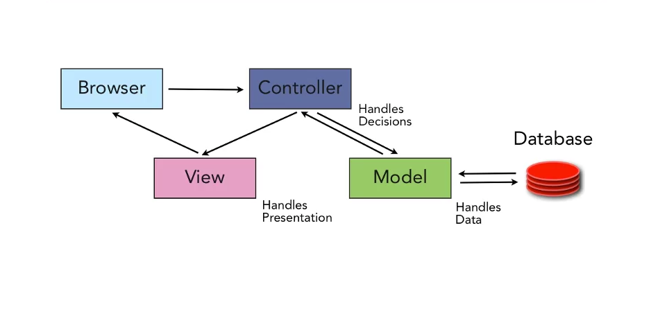
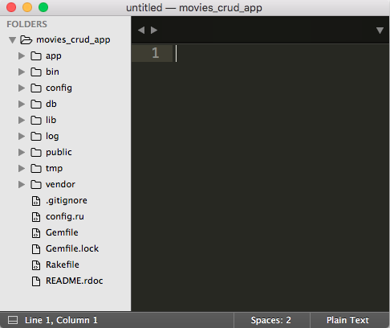

## Objectives
* Draw Diagrams that show the flow of a HTTP Requests and Responses and the how the Model, View and Controller interact.
* Create a cheatsheet for all the Rails and Rack commands. 
* Create a Rails backend app.
* Review the file/directory structure for Rails.
* Initialse the DB for this Rails application.
* Start the Rails app and access it.
* Create ActiveRecord Model.
* Create a Migration.
* Migrate the Rails DB.
* Check the DB for the Table associated with the Model.
* Create a Seed file that will populate the DB.
* Populate the DB with this seed data.
* Create a Controller and index action to view all the Models stored in the DB, persisted data.
* Create a Route for the HTTP Request for a specific path.
* Create a HTTP Request for this path and review it's results. JSON string.
* Create hardcoded HTML in the Controller Action.
* Use a View to generate HTML.
* Show the Layout HTML that is invoked for all HTML.
* Create a Controller show action to view one Model.
* Create a View for to generate a representation of this Model.
* Draw Diagrams that show the flow of a HTTP Requests and Responses and the how the Model, View and Controller interact.


### Model, View, Controller (MVC)

Rails is based on the MVC Architecture.



* A **HTTP Request** is sent from the **Client**, (browser/curl).
* The **URL Path** will determine what **Controller** will be executed.
* The **URL Path** will uniquely indentify a **Resource**, (Song, Movie, Person, ...), this is implemented as **Model**.
* This **Resource** and it's current state is persisted/stored in a **DB** table.
* The **Representation** of this **Resource** is built by the **View**. The **Representation** could be in HTML, JSON, XML, PDF and Image, etc.

We'll talk more about this architecture as we progress. And we'll see how an HTTP Request/Response flows thru and app.


## Create a new Rails application.


###Install Rails.

*Note: this can be done from within any directory*


* Let's see what versions of rails we have installed already. 

```
$ gem list |grep rails
``` 

* Let's install the lastest version of rails.

```
$ gem install rails
```

### Create a Rails application.

Create a Rails app that will use Postrgres for a DB
```
$ rails new movies_crud_app -T --database=postgresql
```

If the above does NOT work then use the default SQLite DB.

```
$ rails new movies_crud_app -T 
```

This will create a Rails application named movies_crud_app.

The -T option, or --skip-test-unit, option will exclude the tests from this Rails app.

The --database=postgresql option will configure this app to use the Postgresql database.


> Note: that it may stall after the `bundle install` command. This is because Rails is loading all the Ruby Gems for app that are listed in the `Gemfile`.

### Review Rail application directory structure.

Change into this `movies_crud_app` directory and take a look at how Rails gives you a very clear location to place all the code you'll be writing.


```
cd movies_crud_app
subl .

```

All Rails apps are structured in a very specific way. This is called **Convention Over Configuration**. The creator of Rails [David Heinemeier Hansson (DHH) ](http://david.heinemeierhansson.com/) has strong opinions about web and software development. In fact, Rails is often described as a *strongly opioniated*. 

There are specific locations in the directory structure for code that serves a specific purpose. 



The **bold** directories are where we'll be writing the vast majority of our application's code.

* __app - Where most code for you application exists.__
* bin - Scripts used by rails, (
* __config - Contains configuration and code that will be excecuted when this app is initialized, i.e. startup code.__
* __db - Contains code needed to setup the DB.__
* lib - General Ruby code that is needed by the app that doesn't fall into the Model/View/Controllers.
* log - Log files.
* public - Mix of front-end files, (HTML, CSS, Images), that mostly generated within your web application.
* tmp - Temp files.
* vendor - Files used for 3rd party libraries that are not gems.


### Create a database for this rails app. 

*Rails always need a DB.*

And Restart rails.

```
rake db:create
```

### Start the Rails app.
```
rails server
```

**Access the default Rails URL.**

In your browser, go to port 3000.

Ya, you should see the Welcome Aboard page. Rails is running!!!

## Create a Movie Model

A Model is a Ruby class that is used to persist a specific resource in a DB table.

Use a rails generator to create a Movie model.

```
rails generate model Movie name:string rating:string desc:text length:integer
```

Notice what files are generated. What are they and what are they used for?

This will generate a Movie model and migration that will create a movies table in the DB.

**Lets look at the generated app/models/movie.rb file.**

** Let's looks at the generated movies migation in db/migration/...


### Migrate DB

Open up the the file db/schema.rb before and after the migrations are run below.

```
rake db:migrate
```

This will run the migrations to create a *movies* table that has a name, rating, desc and length columns. 

*Check the DB to confirm the existence of the movies table and the above columns*

```
rails dbconsole
```

This will bring up **psql**. *Command line utility to view the DB.*

Lets look at all the tables in the DB. And describe the movies table. 

```
\dt
\d movies
```

## Create seed data

This will populate the `movies` table in the DB.

Add the below to db/seeds.rb

```
Movie.delete_all

Movie.create!(name: 'Affliction', rating: 'R', desc: 'Little Dark', length: 123)
Movie.create!(name: 'Mad Max', rating: 'R', desc: 'Fun, action', length: 154)
Movie.create!(name: 'Rushmore', rating: 'PG-13', desc: 'Quirky humor', length: 105)
puts "Created three Movies"
```

```
rake db:seed
```

This rake command will run the code in the db/seeds.rb file which will create three Movies in the DB using ActiveRecord.


***Check with the dbconsole**

```
SELECT * FROM movies;
```
**Check with rails console**

```
rails console
```

The rails console is *VERY* important for debugging and checking rails.  


Run the below commands in the Rails console.  *Notice the SQL that is created by each of the below ActiveRecord methods. 

```
Movie.first
Movie.second
Movie.third
Movie.all
```
What's going on here?

## Lab

* Create a Song resource in **this application**. Each Song will have a title, description, price and length. 

* The title is a simple string, desc is a 'text' field because it could have a lot of text. What should the price and length types be? 

* Look up the rails guide for migrations and find out.

* Create a couple of songs in the db/seeds.rb file. 

* Don't forget to use the rails dbconsole and rails console commands to verify you've created 3 songs.

## Demo: Create Movie Controller Actions and Routes.

We will implement the index, show, create, update and delete actions. 

### Index Action

**Create a movies controller in app/controllers/movies_controller.rb**

```
class MoviesController < ApplicationController

  # GET /movies
  def index
    # all the movies
    @movies = Movie.all
    render json: @movies
  end
end
```

**Add routes to the config/route.rb**

```
# Default root for '/' in this application
  root 'movies#index'

  get '/movies', to: 'movies#index'
```

**Lets render an HTML representation of all the movies**

```ruby
# GET /movies
def index
  @movies = Movie.all
  content = '<html><body><ul>'

  @movies.each do |movie|
    content << "<li>#{movie.name} is #{movie.length} minutes long</li>"
  end

  content << '</ul></body></html>'

  render inline: content
end

```

**Finally Let's use a View to generate the HTML representation**.

```ruby
class MoviesController < ApplicationController
  GET /movies
  def index
    @movies = Movie.all

    # render is implicit here
    # it will render the file in app/views/index.html.erb
  end

end
```

**Create a file app/views/movies/index.html.erb**

```
<ul>
<% @movies.each do |movie| %>
  <li><%=movie.name%> is <%=movie.length%> minutes long.</li>
<% end %>
</ul>

```


### Show Action

**Add this to the app/controllers/movies_controller.rb**

```
# GET /movies/:id
  def show
    # find one Movie by id
    @movie = Movie.find(params[:id])

    render json: @movie
  end
```

```
# :id will identify a specific movie
  get '/movies/:id', to: 'movies#show'
```

### Params hash.

Lets take a look at the params hash.

**Add a breakpoint in the show action.**

```
def show
	byebug
    # find one Movie by id
    @movie = Movie.find(params[:id])


```

**Access http://localhost:3000/movies/1 in your browser**

This will break where we put the breakpoint 'byebug'. Look at the params hash by typing in 'params'.

Notice that it has an entry with a key of 'id' and value of '1'. This entry identifes the movie we're looking for.

Notice that the params hash always has the controller name and action name as well.

*Remove the breakpoint and go to the show the first movie again. Notice that the params hash is also show in the server logs on the command line and in the log/development.log file.*


## Lab

* Add a Songs controller with an index and show action. 

* Don't forget to check it with the rails console as well as the browser. 

* And add a breakpoint into each action and examine the params hash.


## Demo: More Controller Actions

### Create Action

**Comment this line from the app/controllers/application_controller.rb**

```
# protect_from_forgery with: :exception
```

Temporary workaround. 

**Add this to the movies controller**

```
 # POST /movies
  def create
    @movie = Movie.new(movie_params)
    if @movie.save
      render json: @movie, status: :created, location: movies_url
    else
      render json: @movie.errors, status: :unprocessable_entity
     end
  end

  private 
 
  def movie_params
    params.require(:movie)
      .permit(:name, :rating, :desc, :length)
  end
```

**Add this to your routes**

```
# Create a movie.
post '/movies', to: 'movies#create'
```

**Create a Movie, using curl**

This will send a HTTP POST request to /movies. 

The curl -d option acts like a HTML form. Giving the name of resource, movie, and it's attributes. 

```
curl -X POST -d "movie[name]=Movie 2&movie[rating]=r\
&movie[length]=124&movie[desc]=Movie 2 description" http://localhost:3000/movies
```

*Check that a new Movie was created using the rails console.*

### Strong Parameters

Notice the method movie_params. This uses the rails require and permit method to explicitly allow which incoming HTTP body parameters can be used to create a new resource. 

```
params.require(:movie)
      .permit(:name, :rating, :desc, :length)
```

Look up strong parameters in the Rails Guide. 

## Lab: Create a Song.

## Demo: More Controller Actions

### Update Action

**Add this to the movies controller**

```
# PATCH /movies/:id
  def update
    @movie = Movie.find(params[:id])
    if @movie.update(movie_params)
      head :no_content
    else
      render json: @movie.errors, status: :unprocessable_entity
    end
  end
```

**Add this route for update**

```
# Update a movie
patch '/movies/:id', to: 'movies#update'
```

This will update a specific movie

**Update the movie with id 2 with a new rating**

```
curl -X PATCH -d "movie[rating]=pg-13" http://localhost:3000/movies/2
```

### Delete Action

**Add this to the movies controller**

```
# DELETE /movies/:id
  def delete
    @movie = Movie.find(params[:id])
    @movie.delete

    head :no_content
  end
```

**Add this to your routes**

```
# delete a movie
delete '/movies/:id', to: 'movies#delete'
```

**Delete a movie with id of 1**

```
curl -X DELETE localhost:3000/movies/1
```

